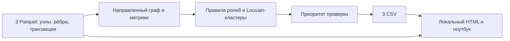

# «Граф денег» — Specialz

Проект команды Specialz для кейса «Граф денег» хакатона HackAlem AI. Решение строит направленный граф денежных переводов, присваивает узлам объяснимые роли, выделяет сообщества и формирует список узлов для первичного анализа. Интерактивный ноутбук позволяет изучать граф и окружение конкретного клиента.

Текущая выборка: **2248 узлов, 3119 рёбер, 4840 транзакций и 81 seed-клиент**. В сохранённых результатах — **87 кластеров** и **25 узлов** в рейтинге.

## Что реализовано: 5 must-have пунктов

1. **Граф и метрики.** Загрузка трёх Parquet-файлов, проверка наличия одинаковых пар `src/dst` в рёбрах и транзакциях, построение `nx.DiGraph`. Рассчитываются входящие и исходящие степени, суммы и количества переводов, взвешенный PageRank, betweenness и `pass_through`. Узлы без рёбер сохраняются в результатах.
2. **Объяснимые роли.** Восемь последовательных правил назначают одну из шести ролей, `role_score` и `evidence` с конкретными метриками. Учитываются граница обхода и особенности seed-клиентов.
3. **Кластеризация.** Louvain на `G.to_undirected()` с `weight="sum_kzt"` и `seed=42`. Для каждого кластера рассчитываются размер, число seed, внутренний оборот, топ-5 по PageRank и текстовая гипотеза.
4. **Приоритизация и выгрузки.** Составной `priority_score`, топ-25 с объяснениями `why` и три CSV-файла: `nodes_roles.csv`, `clusters.csv`, `top_nodes.csv`.
5. **Интерактивное исследование.** В `analysis.ipynb` доступны таблица топ-25, граф PyVis с окраской по ролям и подсказками `evidence`, а также `search_node(gid)` с таблицей метрик и ego-графом радиуса 2.

## Схема решения



Для жюри откройте этот README на GitHub: блок Mermaid отображается как диаграмма. Для офлайн-демо заранее сохраните её изображение или покажите ту же последовательность из блока в редакторе с поддержкой Mermaid. Локальная HTML-страница от Mermaid и интернета не зависит.

## Логика присвоения ролей

Правила в `assign_roles()` проверяются сверху вниз: **первое совпадение побеждает**. `in_deg` и `out_deg` — число входящих и исходящих связей; `pass_through = out_kzt / in_kzt` при положительном `in_kzt`, иначе `NaN`.

| № | Условие | Роль | role_score |
| --- | --- | --- | --- |
| 1 | `in_deg == 0` и `out_deg == 0` | `peripheral` | 0.9 |
| 2 | `depth == 4` и `out_deg == 0` | `terminal`, с пометкой «артефакт глубины» | 0.5 |
| 3 | `out_deg == 0` и `depth < 4` | `terminal` | 0.9 |
| 4 | `betweenness > 0`, `betweenness >= p95`, `in_deg >= 2` и `out_deg >= 2` | `coordinator` | 0.8 |
| 5 | `in_deg >= 3`, `pass_through < 0.3` и `is_seed == False` | `consolidator` | 0.8 |
| 6 | `out_deg >= 10` | `distributor` | 0.8 |
| 7 | `0.7 <= pass_through <= 1.3`, `in_deg >= 1`, `out_deg >= 1` и `is_seed == False` | `transit` | 0.8 |
| 8 | Ни одно из предыдущих условий не выполнено | `peripheral` | 0.4 |

`p95` — 95-й перцентиль betweenness по узлам `df`; совпадения на границе включаются. Betweenness считается на направленном графе без весов: сумма перевода не используется как длина пути. Для seed применяются структурные правила 1–3, затем правила 4 и 6, иначе правило 8; правила 5 и 7 пропускаются.

**Особенности выборки.** 444 узла обрезаны 4-м коленом (`depth == 4`, `out_deg == 0`): это артефакт обхода данных, а не подтверждённый «сток». В текущей выгрузке они имеют `terminal`, пониженный `role_score=0.5` и явное пояснение «артефакт глубины». У seed-клиентов `in_kzt` занижен по устройству выборки, поэтому `consolidator` для них не определяется по `pass_through`; в текущей реализации также исключён `transit`. Соответствующая оговорка включена в `evidence` каждого seed-узла.

## Кластеры и приоритет

`assign_clusters_and_priority()` добавляет `cluster_id` и `priority_score`. Изоляты включаются в кластеризацию как отдельные узлы. Внутренний оборот кластера считается по исходному направленному графу: суммы обоих направлений взаимных переводов учитываются отдельно. `top_gids` содержит до пяти идентификаторов по убыванию PageRank, разделённых `;`. Гипотеза основана на наиболее частой роли, её количестве и числе seed; при равенстве частот роль выбирается по алфавиту.

```text
priority_score = 0.4 × normalized(pagerank)
               + 0.3 × normalized(betweenness)
               + 0.2 × role_priority
               + 0.1 × seed_neighbor_fraction
```

Нормализация — min–max по `df`; постоянная метрика преобразуется в нули. `role_priority` равен 1 для `consolidator` и `coordinator`, 0.5 для `distributor`, иначе 0. Доля seed-соседей считается среди уникальных соседей обоих направлений, без самого узла; для изолятов она равна 0. Рейтинг сортируется по убыванию приоритета, при равенстве — по возрастанию `gid`.

## Установка и запуск

Выполняйте команды из корня проекта в выбранном Python-окружении:

```bash
python -m pip install -r requirements.txt
python starter.py --data ./data --out ./out
```

В папке `data/` должны находиться `edges.parquet`, `nodes.parquet` и `transactions.parquet`. Если `--data` не передан, используется папка `data` рядом со `starter.py`. Повторный запуск перезаписывает три CSV в выбранной папке результатов.

| Файл | Содержимое |
| --- | --- |
| `out/nodes_roles.csv` | Все узлы: роль, score, кластер, приоритет, evidence, степени, суммы, PageRank, pass_through, глубина и флаги |
| `out/clusters.csv` | `cluster_id`, `n_nodes`, `n_seed`, `sum_kzt_internal`, `top_gids`, `hypothesis` |
| `out/top_nodes.csv` | До 25 строк: `rank`, `gid`, `role`, `priority_score`, `why` |

## Как проверить

После запуска пайплайна и генератора выполните `python audit_project.py`: проверяются обязательные поля, все правила ролей, кластеры, топ и автономный HTML. Дополнительно `node audit_ui.cjs` (нужен Node.js только для этой проверки) проверяет обработчики поиска, таблиц и SVG на модели DOM; это не заменяет визуальный просмотр в браузере. Итоги финальной проверки — в [AUDIT.md](AUDIT.md).

Откройте [analysis.ipynb](analysis.ipynb) в Jupyter или VS Code с поддержкой ноутбуков, выберите Python-ядро с установленными зависимостями и выполните **Run All**. Для отдельной установки JupyterLab можно использовать `pip install jupyterlab`, затем `jupyter lab`. Первая ячейка пересчитывает результаты и обновляет `out/`, вторая показывает топ-25, ячейка «Интерактивный граф» создаёт `graph.html`. PyVis и ядро ноутбука включены в `requirements.txt`.

После выполнения ячеек вызовите:

```python
search_node("100000000343175100")
```

Это seed-узел из текущих данных. Функция выводит его строку из `df` и создаёт `ego_100000000343175100.html`. Ego-граф строится через `nx.ego_graph(G, gid, radius=2)` и следует исходящим рёбрам. Изолированный узел отображается отдельно; для неизвестного `gid` выводится сообщение. HTML-файлы сохраняются в текущую рабочую папку ядра.

Цвета графа: `consolidator` — красный, `distributor` — оранжевый, `transit` — жёлтый, `terminal` — синий, `coordinator` — фиолетовый, `peripheral` — серый. При наведении на узел показывается `evidence`; seed-узлы крупнее остальных. Передавайте длинные `gid` строками или целыми числами, не `float`: в PyVis идентификаторы преобразуются в строки для сохранения точности.

Для проверки особенностей выборки после Run All:

```python
cut = df[df["truncated_by_depth"]]
assert len(cut) == 444  # Для текущего набора данных
assert cut["evidence"].str.contains("артефакт глубины", regex=False).all()
assert cut["role"].eq("terminal").all()
assert cut["role_score"].eq(0.5).all()
seeds = df[df["is_seed"]]
assert not seeds["role"].isin(["consolidator", "transit"]).any()
assert seeds["evidence"].str.contains("in_kzt занижен", regex=False).all()
assert df.loc[df["in_kzt"].eq(0), "pass_through"].isna().all()
```

## Локальный интерфейс аналитика

После расчёта CSV создайте автономную страницу одной командой из корня проекта (в окружении с зависимостями):

```bash
python build_analyst_ui.py --data ./data --out ./out
```

Откройте `out/analyst.html` двойным щелчком. Сервер, интернет и CDN не нужны: данные, стили и код встроены в один файл. Можно перенести этот файл отдельно. Генератор читает `out/nodes_roles.csv`, `out/top_nodes.csv` и `data/edges.parquet`, не пересчитывает роли и не изменяет обязательные CSV. После обновления исходных результатов повторите генерацию.

Введите полный gid, например `100000008346837100` или `100000002224132100`, либо выберите узел в топ-25. Карточка показывает роль, приоритет проверки с тремя десятичными знаками, кластер и суммы в ₸. Над раскрывающимся блоком «Технические показатели» с исходным evidence дано русское объяснение сработавшего правила; для границы глубины явно обозначен обрыв наблюдения. Приоритет — относительный порядок проверки, не вероятность нарушения; две таблицы содержат все наблюдаемые входящие и исходящие связи с суммами и количеством переводов. Стрелка всегда направлена от отправителя к получателю; идентификаторы кликабельны и хранятся строками без округления. Схема ближайших соседей показывает стрелки переводов, цвет роли и номер кластера; нажатие на узел открывает его карточку. Для читаемости схема ограничена 12 связями каждого направления с наибольшей суммой, таблицы ниже содержат все связи. Временной показатель доступен отдельно в ноутбуке. Роли и приоритеты — гипотезы для проверки, не вывод о виновности.

## Бонус: временное соседство переводов

В `analysis.ipynb` для каждого исходящего перевода ищется ближайшая строго предыдущая календарная дата входящего перевода того же `gid` (`merge_asof`, `direction="backward"`, `allow_exact_matches=False`). В результат попадают исходящие события через 1–2 дня после этой даты; переводы в тот же день не образуют пару, поскольку время суток неизвестно. Если входящие были и в день исходящего, и раньше, учитывается ближайшая дата строго раньше дня исходящего. Каждое исходящее событие учитывается не более одного раза; несколько исходящих могут иметь одну предыдущую дату входящих.

Таблица показывает до 20 узлов, отсортированных по числу подходящих исходящих переводов и их сумме: `n_out_1_2_days`, `out_kzt_1_2_days`, `example_in_date` (самая ранняя из сопоставленных входящих дат), роль и текущий приоритет. Полный результат доступен в `temporal_summary`, пары дат — в `quick`. При проверенном полном запуске в `.venv` получены **297 узлов и 1594 исходящих события**.

Для воспроизведения откройте ноутбук, выберите ядро `.venv` и выполните **Run All**: бонусная ячейка выводит таблицу и число узлов, следующая — примеры пар дат для первого узла. Это наблюдаемое соседство событий, а не доказательство того, что переводятся те же самые деньги: суммы не сопоставляются, порядок внутри дня неизвестен, входящие seed и границы периода неполны. Бонус не меняет правила ролей, формулу приоритета и схемы трёх обязательных CSV.

## Масштабирование до 1 млн узлов

Текущая реализация загружает данные и граф в память и вычисляет точную betweenness; работа на 1 млн узлов в проекте не подтверждена. Для такого объёма потребуется перейти к приближённой betweenness по выборке источников и более компактному графовому движку, предварительно проверив соответствие результатов. Агрегацию переводов и расчёт локальных метрик следует выполнять пакетно, а глобальные метрики и сообщества рассчитывать отдельно и сохранять для повторного использования. Визуализацию следует ограничить выбранными кластерами и ego-графами вместо передачи всей сети в браузер; это план развития, а не реализованные возможности.

## Ограничения подхода

Данные организаторов предназначены исключительно для хакатона. Исходные Parquet не включены в Git: используйте выданную организаторами папку `data/`. Наблюдаются только внутрибанковские переводы за июль 2026 года от 5 000 KZT; дробление ниже порога и переводы вне банка не видны.

- Роли, пороги и веса приоритета заданы эвристически. `role_score` не является откалиброванной вероятностью; метрик качества по размеченным ролям в текущем коде нет.
- Граф отражает доступную выборку. Обрезка глубины и неполные входящие переводы seed ограничивают интерпретацию ролей и центральностей; высокий приоритет означает порядок просмотра, а не доказанное нарушение.
- `pass_through` сравнивает агрегированные суммы и не восстанавливает последовательность движения конкретных средств. Даты транзакций загружаются, но временной анализ в правилах не используется.
- Louvain работает на неориентированной проекции и теряет направление связей. При `G.to_undirected()` веса взаимных рёбер не суммируются автоматически; это ограничение кластеризации, хотя `sum_kzt_internal` рассчитывается отдельно по исходному графу.
- Гипотеза кластера формируется по доминирующей роли и числу seed, без отдельной проверки сценария. Порог `p95` включает совпадения, поэтому доля кандидатов по центральности может отличаться от ровно 5%.
- `sanity_check()` проверяет совпадение пар `src/dst` между рёбрами и транзакциями, но не сравнивает агрегированные суммы и количества, несмотря на сообщение `edges == transactions : OK`.
- Точная betweenness и отображение всей сети PyVis могут стать узкими местами на больших данных. CLI формирует CSV; граф доступен в ноутбуке, поиск и таблицы связей — также в автономной HTML-странице. Страница загружает весь снимок в память и рассчитана на текущий объём данных.
